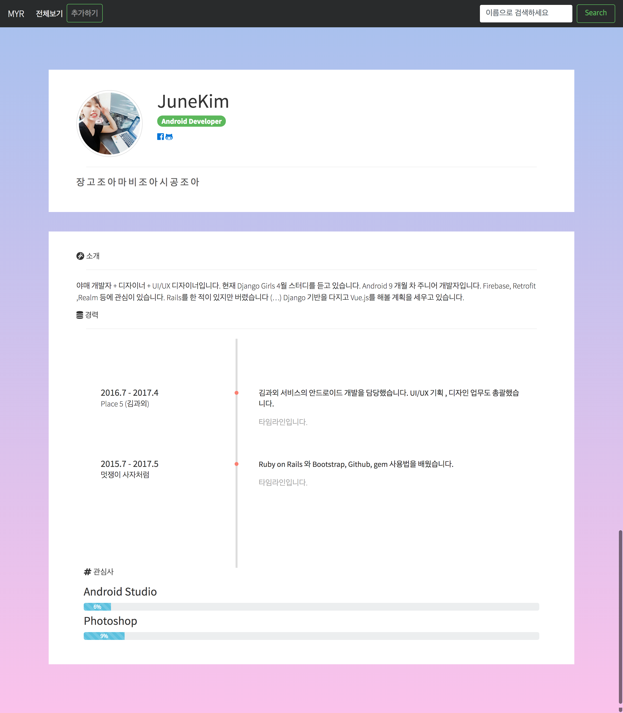

# 기술스택만 입력해서 이력서를 만들어보자 (MakeYourResume)

## 사용기술
* Django
* Python3
* Bootstrap4
* 약간의 Vue.js


## 개발환경
* OS X  El Capitan (버전 10.11.1)
* Atom


## 실행방법
OS X 기준
```
python3 -m venv (가상환경이름)
#가상환경 설치

source (가상환경이름)/bin/activate
#해당 디렉토리에서 가상환경을 실행시킨다

pip install -r requirements.txt
#requirement를 설치한다.

python manage.py makemirgations
# migration 파일을 만든다

python manage.py migrate
# migration을 적용한다.

python manage.py runserver
#서버를 돌리고 localhost:8000/resume에서 확인해본다
```

## 2017.05.28 스크린샷

## 2017.05.21 스크린샷

## 2017.05.14 스크린샷


## 2017.05.07 스크린샷


## 2017.5.28 업데이트
* 이미지 업로드 / 적용
* resume 템플릿 첫번째 만들기
* 타임라인 css로 구현
* 경험 입력 란
* 소개, 한줄소개 입력란  
* 데이타임피커
* 이미지 null 일때 처리
* 이미지 정사각형에 들어가게
* tag 만들기
* 개인 정보에 페이스북이랑 깃헙 주소 받기
* input 그룹 나누기
* 타임라인 보조

## 2017.05.28  기준
* 템플릿을 서버단에서 하는게 아니라 ajax로 가져오게 하기
* tag 별 검색 혹은 분류
* 데이터 수정 페이지
* startDate 가 endDate보다 선행되게 ( 검사)
* pdf 로 다운로드
* 검색 예시
* 템플릿 선택
* tags 겹침
